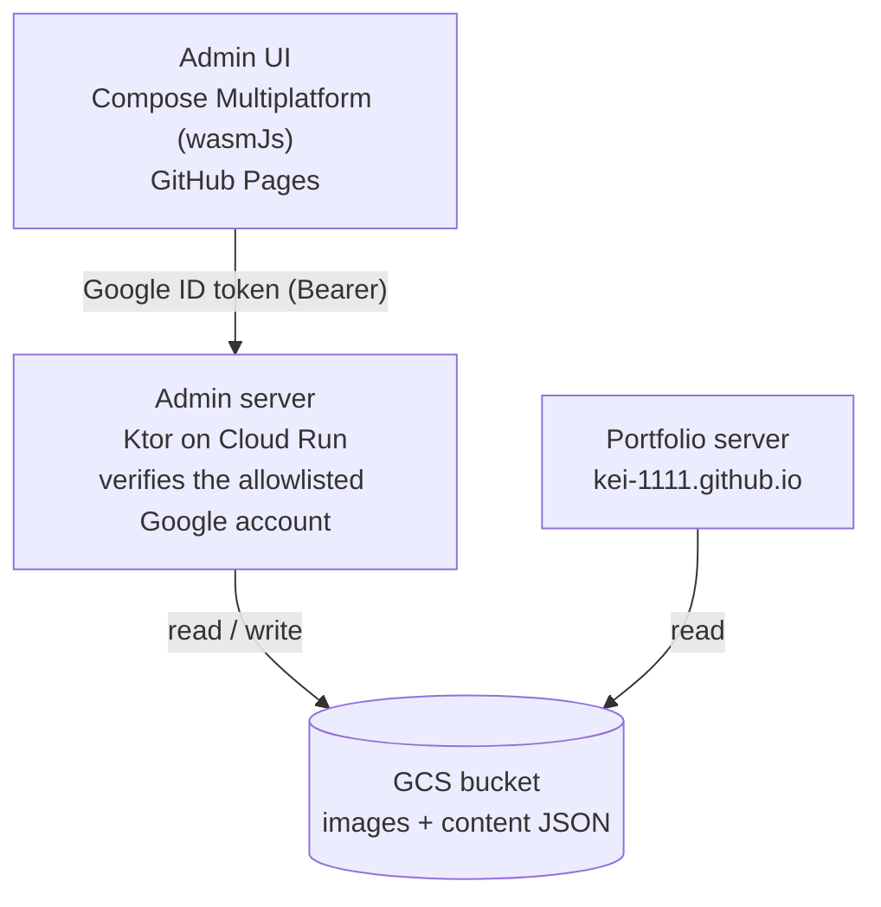

# portfolio-admin

Admin console for [kei-1111.github.io](https://github.com/kei-1111/kei-1111.github.io): manages the images and text content that the portfolio server delivers, backed by Google Cloud Storage.

## Architecture



- **Auth**: Google Identity Services in the admin UI issues an ID token; the admin server verifies it and allows a single allowlisted account.
- **Storage**: one GCS bucket holds both image assets and text content (JSON). The portfolio server reads the same bucket, so content changes go live without a redeploy.

## Modules

| Module | Description |
|---|---|
| `composeApp` | Admin UI — Compose Multiplatform, wasmJs target only |
| `server` | Admin API — Ktor (CIO), deployed to Cloud Run |
| `shared` | DTOs shared between UI and server (wasmJs + jvm) |

## Commands

```bash
./gradlew :composeApp:wasmJsBrowserDevelopmentRun   # UI dev server
./gradlew :composeApp:wasmJsBrowserDistribution     # UI production build
./gradlew :server:run                               # Admin server (http://localhost:8082; Cloud Run injects PORT)
./gradlew :server:buildFatJar                       # server/build/libs/server-all.jar
./gradlew :server:test                              # server tests
```

## Setup status

- [x] Project scaffold (Kotlin 2.4.0 / Compose Multiplatform 1.11.1 / Ktor 3.5.1 / Gradle 9.6.1)
- [ ] GCS bucket + service account
- [ ] Google OAuth client (Identity Services) + ID-token verification on the server
- [ ] Image upload / list / delete API + UI
- [ ] Text content (JSON) edit API + UI
- [ ] CI (build + test) and CD (GitHub Pages / Cloud Run)
- [ ] Portfolio server reads content from the GCS bucket
