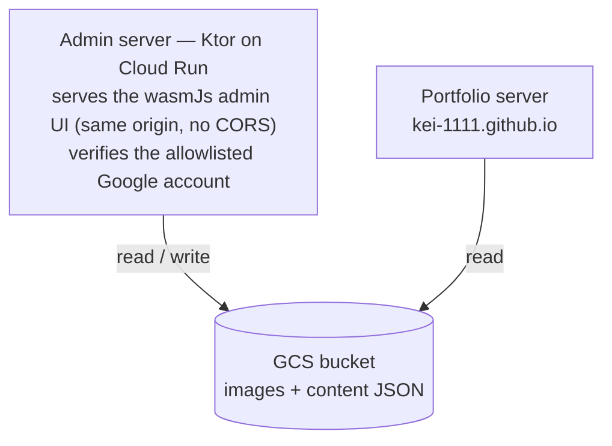

# portfolio-admin

Admin console for [kei-1111.github.io](https://github.com/kei-1111/kei-1111.github.io): manages the images and text content that the portfolio server delivers, backed by Google Cloud Storage.

## Architecture



The Compose Multiplatform (wasmJs) admin UI is bundled into the server's fat jar (`-PbundleWebApp`) and served by the admin server itself — deliberately **not** GitHub Pages, so the console never sits on a public static URL and the UI and API share one origin.

- **Auth**: Google Identity Services in the admin UI issues an ID token; the admin server verifies it and allows a single allowlisted account.
- **Storage**: one GCS bucket holds both image assets and text content (JSON). The portfolio server reads the same bucket, so content changes go live without a redeploy.

## Modules

| Module | Description |
|---|---|
| `app:webApp` | Admin UI entry point — Metro DI graph, Navigation 3 `AppNavDisplay` (wasmJs only) |
| `app:core:common` | `Result<T>` / suppression helpers / `InteractionLog` |
| `app:core:designsystem` | Theme (`AdminTheme`) |
| `app:core:mvi` | `MviViewModel` base + MVI marker interfaces |
| `app:core:navigation` | Dialog scene strategy, result bus, transitions |
| `app:core:testing` | Test infrastructure for commonTest (host tests) |
| `app:feature:home` | Home screen (MVI reference shape) |
| `shared:model` | DTOs shared between UI and server (wasmJs + jvm) |
| `server` | Admin API — Ktor (CIO), deployed to Cloud Run |

Details: `docs/ModuleOverview.md` / `docs/ArchitectureOverview.md` (Japanese).

## Commands

```bash
./gradlew :app:webApp:wasmJsBrowserDevelopmentRun   # UI dev server (the :app:webApp: prefix is required)
./gradlew :app:webApp:wasmJsBrowserDistribution     # UI production build
./gradlew :server:run                               # Admin server (http://localhost:8082; Cloud Run injects PORT)
./gradlew :server:buildFatJar -PbundleWebApp        # deployable jar with the admin UI bundled (server/build/libs/server-all.jar)
./gradlew :server:test                              # server tests
```

## Setup status

- [x] Project scaffold (Kotlin 2.4.0 / Compose Multiplatform 1.11.1 / Ktor 3.5.1 / Gradle 9.6.1)
- [x] Infrastructure parity with kei-1111.github.io: convention plugins, detekt, MVI + Metro DI + Navigation 3, host tests
- [ ] GCS bucket + service account
- [ ] Google OAuth client (Identity Services) + ID-token verification on the server
- [ ] Image upload / list / delete API + UI
- [ ] Text content (JSON) edit API + UI
- [x] CI (detekt / compile / host tests / server tests, docs-only gated)
- [ ] CD to Cloud Run (single service: admin API + bundled UI)
- [ ] Portfolio server reads content from the GCS bucket
