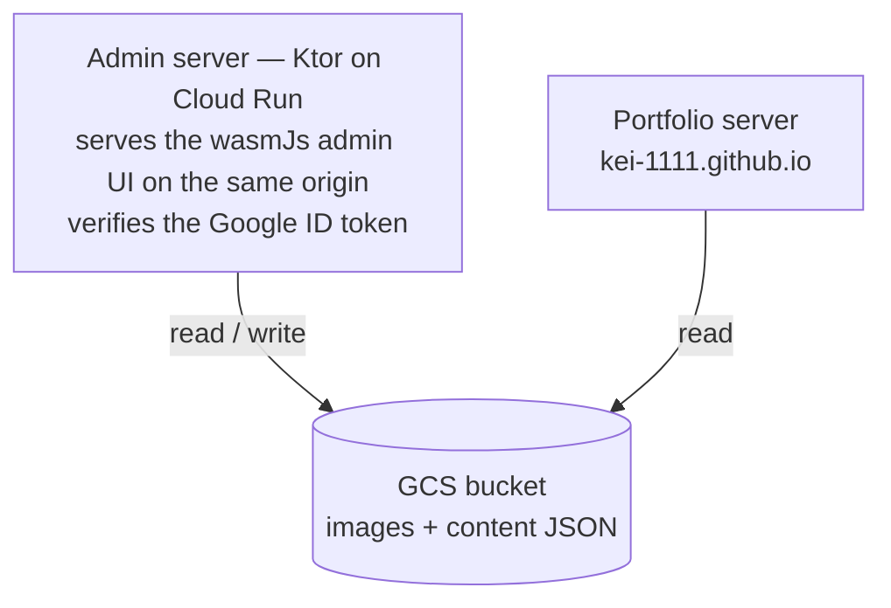

# Architecture Overview

Architecture overview of kei-1111-admin. It uses the same foundation as kei-1111.github.io (multimodule Clean Architecture + MVI + Metro DI + Navigation 3).

## Big Picture

- **UI delivery**: the wasmJs admin UI is bundled into the server's fat jar (`:server:buildFatJar -PbundleWebApp`) and served statically by the admin server itself. GitHub Pages is deliberately not used — the console must not sit on a public static URL, and sharing one origin with the API removes the need for CORS.
- **Auth**: the admin UI obtains an ID token through Google Identity Services; the admin server verifies the audience (OAuth client ID) and the allowlisted email address. Exactly one account can use it.
- **Storage**: a single GCS bucket holds both image assets and content JSON. The portfolio server reads the same bucket, so content changes go live without a redeploy.

## Client (app/)

- **MVI**: `MviViewModel<ViewModelState, State, Intent>` (`app:core:mvi`). The UI dispatches an Intent, the ViewModel updates its internal state with `updateViewModelState { copy(...) }`, and `toState()` projects the public State. One-shot side effects use `effect` + the `MviEffect` composable. Detail: `.claude/rules/mvi-architecture.md`
- **DI**: Metro. `AppGraph` in `app:webApp` (`@DependencyGraph(AppScope)`) is the only graph. ViewModels are aggregated into a multibinding via `@ContributesIntoMap` and obtained with `metroViewModel()` inside a navigation entry.
- **Navigation**: Navigation 3. `AppNavDisplay` owns a single `NavDisplay` plus a flat back stack. wasmJs has no reflection, so each feature contributes a `SerializersModule` fragment for its NavKeys via `@IntoSet`. Detail: `.claude/rules/navigation.md`
- **Data layer**: repositories and UseCases are `suspend fun`s and let failures propagate as exceptions. The ViewModel absorbs them once with `recoverOrElse` and folds the outcome into `ViewModelState` flags. Detail: `.claude/rules/data-layer.md` / `.claude/rules/usecase.md` / `.claude/rules/error-handling.md`

## Server (server/)

Ktor (CIO) on the JVM. Layering is routing (HTTP translation only) → service (validation and storage policy) → storage (raw blob access to the backend). Detail: `.claude/rules/server.md`. The Cloud Run service is deployed `--allow-unauthenticated` so it can serve the UI and `/health`; the admin API is protected by application-layer Google ID token verification. Because unauthenticated requests also cost a verification, `/api/**` is rate limited outside the authentication block.

## Tests

- Client: commonTest runs as host tests (local JVM) on the non-shipped Android target. `.claude/rules/app-testing.md` / `mvi-testing.md`
- Server: JUnit 5 + `testApplication`. `.claude/rules/server-testing.md`
- New logic is developed test-first (`.claude/rules/tdd.md`)
