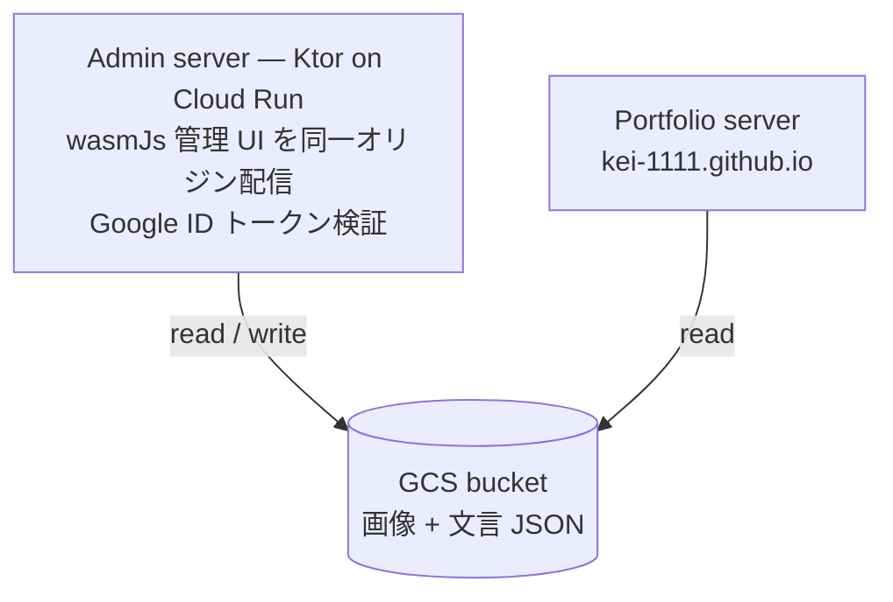

# Architecture Overview

kei-1111-admin のアーキテクチャ概要。kei-1111.github.io と同じ基盤(Clean Architecture 多モジュール + MVI + Metro DI + Navigation 3)を採用している。

## 全体像

- **UI 配信**: wasmJs の管理 UI はサーバーの fat jar に同梱され(`:server:buildFatJar -PbundleWebApp`)、admin server 自身が静的配信する。意図的に GitHub Pages を使わない — 管理コンソールを公開静的 URL に置かず、UI と API を同一オリジンにして CORS も不要にするため。
- **認証**: 管理 UI が Google Identity Services で ID トークンを取得し、admin server が audience(OAuth クライアント ID)と許可メールアドレスを検証する。利用者は 1 アカウントのみ。
- **ストレージ**: 1 つの GCS バケットに画像アセットと文言 JSON を置く。ポートフォリオ側サーバーが同じバケットを読むため、コンテンツ変更はデプロイなしで本番に反映される。

## クライアント (app/)

- **MVI**: `MviViewModel<ViewModelState, State, Intent>`(`app:core:mvi`)。UI は Intent を dispatch し、ViewModel が `updateViewModelState { copy(...) }` で内部状態を更新、`toState()` で公開 State に射影する。一発性の副作用は `effect` + `MviEffect` composable。詳細: `.claude/rules/mvi-architecture.md`
- **DI**: Metro。`app:webApp` の `AppGraph`(`@DependencyGraph(AppScope)`)が唯一のグラフ。ViewModel は `@ContributesIntoMap` で multibinding に集約され、navigation entry 内の `metroViewModel()` で取得する
- **Navigation**: Navigation 3。単一 `NavDisplay` + フラットな back stack を `AppNavDisplay` が所有。wasmJs はリフレクション不可のため、各 feature が NavKey の `SerializersModule` 断片を `@IntoSet` で提供する。詳細: `.claude/rules/navigation.md`
- **エラーハンドリング**: 独自 `Result<T>`(`app:core:common`)+ ViewModel 境界での `.asResult()`。詳細: `.claude/rules/error-handling.md`

## サーバー (server/)

Ktor (CIO) JVM。層構成は routing(HTTP 変換のみ)→ service(ポリシー)→ storage(GCS アクセス)。詳細: `.claude/rules/server.md`。認証は Ktor プラグイン/インターセプタで管理ルート前段に置く(`/health` のみ公開)。

## テスト

- クライアント: commonTest を非出荷 Android ターゲットのホストテスト(ローカル JVM)で実行。`.claude/rules/app-testing.md` / `mvi-testing.md`
- サーバー: JUnit 5 + `testApplication`。`.claude/rules/server-testing.md`
- 新規ロジックは TDD(`.claude/rules/tdd.md`)
