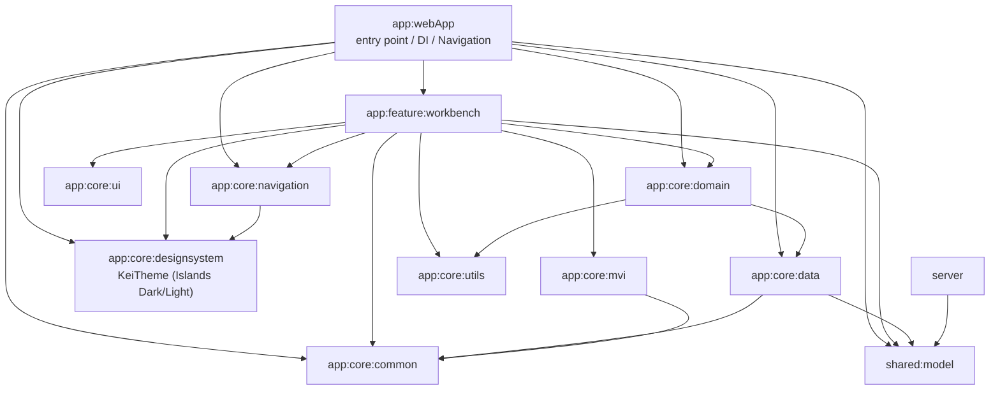

# Module Overview

Responsibilities and dependencies of each module. The tree mirrors kei-1111.github.io.

## Dependency Graph

`app:core:testing` is omitted from the graph: it is test infrastructure (`ViewModelTestBase` / `startCollecting`) referenced only from each module's commonTest.

## Module Responsibilities

| Module | Responsibility |
|---|---|
| `app:webApp` | Entry point. Metro `AppGraph`, `AppNavDisplay` (NavDisplay + back stack), applying `KeiTheme`, Google Sign-In wiring |
| `app:feature:workbench` | IDE-style admin screen. The shared shell (title bar / nav tree / tabs / status bar) plus the full MVI set for the works list, work editor, profile editor, README and terminal editors, and the publish flow |
| `app:core:data` | Admin server API client (Ktor + Bearer). `AdminContentRepository` (draft/published), `AdminPreviewRepository` (portfolio preview data), `AdminImageRepository` (image upload), `AdminPublishRepository`, and the Metro bindings |
| `app:core:ui` | Stateful UI helpers with no visual identity of their own (HoverState) |
| `app:core:utils` | Platform-dependent utilities (prefersReducedMotion / appOrigin / image picker) |
| `app:core:domain` | Content UseCases (get/save works, profile, terminal, readme, meta, publish, discard) and image UseCases (PickImage / UploadWorkImage / UploadProfileImage). Interface + impl so features can fake them |
| `app:core:common` | Cancellation-safe suppression helpers (`recoverOrElse` / `runBestEffort`), `InteractionLog`, `AdminAuthController` (ID token state), dispatcher bindings, plus the ported `Result<T>` / `asResult()` kept for the day a Flow-shaped data source appears |
| `app:core:designsystem` | `KeiTheme` ported from kei-1111.github.io (Islands Dark/Light colors, typography, shapes, icons, fonts) |
| `app:core:mvi` | `MviViewModel` base, `Intent` / `State` / `ViewModelState` markers, the `MviEffect` composable |
| `app:core:navigation` | `InlineDialogSceneStrategy`, `ResultEventBus`, transition animation extensions |
| `app:core:testing` | commonTest infrastructure: `ViewModelTestBase` (Main dispatcher replacement), `startCollecting` |
| `shared:model` | DTOs shared between the UI and the server (jvm + wasmJs) |
| `server` | Admin API (Ktor CIO, Cloud Run). GCS read/write, Google ID token verification, image acceptance validation and public serving, and the draft → published copy operation |

## Dependency Rules

- feature → core / shared only. Dependencies between features are prohibited (screen-to-screen wiring goes through lambdas in `app:webApp`'s `AppNavDisplay`)
- Metro does not aggregate `@ContributesBinding` / `@ContributesIntoMap` from transitive dependencies, so a contributing module must be a direct dependency of `app:webApp`
- Module configuration goes through the build-logic convention plugins (`kei_1111.*`) — see `.claude/rules/gradle.md`
