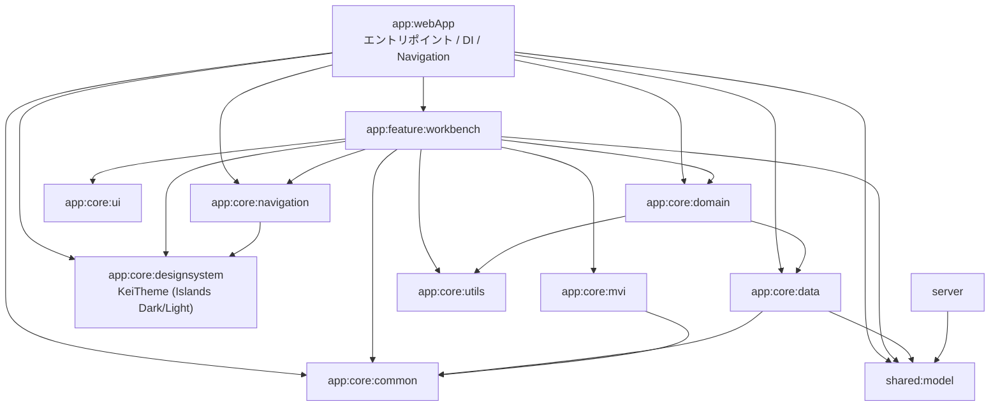

# Module Overview

各モジュールの責務と依存関係。kei-1111.github.io と同じ木構造を採用している。

## 依存グラフ

`app:core:testing` は各モジュールの commonTest からのみ参照されるテスト基盤(`ViewModelTestBase` / `startCollecting`)のため、グラフからは省略。

## モジュール責務

| モジュール | 責務 |
|---|---|
| `app:webApp` | エントリポイント。Metro `AppGraph`、`AppNavDisplay`(NavDisplay + back stack)、`KeiTheme` 適用、Google Sign-In 配線 |
| `app:feature:workbench` | IDE 風管理画面。共通シェル(タイトルバー/ナビツリー/タブ/ステータスバー)+ Works 一覧 + 作品編集 + Profile 編集の MVI 一式 |
| `app:core:data` | 管理サーバー API クライアント(ktor + Bearer)。`AdminContentRepository`(下書き/公開)・`AdminPreviewRepository`(本体プレビューデータ)・`AdminImageRepository`(画像アップロード)と Metro バインディング |
| `app:core:ui` | 視覚的アイデンティティを持たないステートフル UI ヘルパー(HoverState) |
| `app:core:utils` | プラットフォーム依存ユーティリティ(prefersReducedMotion / appOrigin / 画像ピッカー) |
| `app:core:domain` | コンテンツ UseCase(Get/Save works・profile、meta、publish)と画像 UseCase(PickImage/UploadWorkImage)。interface + Impl で feature からフェイク可能 |
| `app:core:common` | 独自 `Result<T>` / `asResult()`、キャンセル安全な抑制ヘルパー(`recoverOrElse` / `runBestEffort`)、`InteractionLog`、`AdminAuthController`(ID トークン状態)、Dispatcher バインディング |
| `app:core:designsystem` | kei-1111.github.io から移植した `KeiTheme`(Islands Dark/Light の配色・タイポ・シェイプ・アイコン・フォント) |
| `app:core:mvi` | `MviViewModel` 基底、`Intent` / `State` / `ViewModelState` マーカー、`MviEffect` composable |
| `app:core:navigation` | `InlineDialogSceneStrategy`、`ResultEventBus`、遷移アニメーション拡張 |
| `app:core:testing` | commonTest 用基盤: `ViewModelTestBase`(Main dispatcher 差し替え)、`startCollecting` |
| `shared:model` | UI とサーバーで共有する DTO(jvm + wasmJs) |
| `server` | 管理 API(Ktor CIO、Cloud Run)。GCS 読み書き・Google ID トークン検証(予定) |

## 依存ルール

- feature → core / shared のみ。feature 間依存は禁止(画面間の連携は `app:webApp` の `AppNavDisplay` がラムダで配線)
- Metro の `@ContributesBinding` / `@ContributesIntoMap` は推移的依存から集約されないため、コントリビュートするモジュールは `app:webApp` の直接依存に置く
- モジュール設定は build-logic の convention plugin(`kei_1111.*`)経由(`.claude/rules/gradle.md`)
